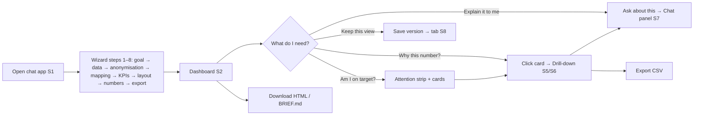

# User flows: ITSM KPI Dashboard + chat (input for MagicPath layout generation)

> Describes **who does what, in which order, on which screen, and what they must see**. Use it together
> with `magicpath-prompt.md`: that file covers content and style, this one covers journeys and screen states.
> Neutral naming. Sample data = synthetic August 2026.

## Personas
- **Maria, Service Desk manager** (primary): monthly review and management meetings; weekly check of breaches; not a data analyst; trusts numbers only when she can see how they were calculated.
- **Tom, team lead**: daily or weekly; lives in the at-risk list; wants to sort, filter and hand tickets over.
- **Management reader**: opens a shared offline copy; reads headline numbers only.

## Screen inventory
| ID | Screen / surface | Purpose |
|---|---|---|
| S1 | Chat app (full): chat on the left, preview on the right, version tabs | build the dashboard with the assistant (wizard) |
| S2 | Dashboard: *Dashboard* tab | overview for a month |
| S3 | Dashboard: *Verification* tab | proof: independent recalculation + sample tickets |
| S4 | Dashboard: *Data & assumptions* tab | what was loaded, removed, mapped, assumed |
| S5 | Drill-down modal (FCR / SLA variant) | why + breakdown + ticket list |
| S6 | Drill-down modal (CSAT variant) | rating distribution + months |
| S7 | Chat side panel (in the dashboard window): collapsed / overlay / pinned | conversation next to the data |
| S8 | Saved version tab (read-only) | compare or restore a snapshot |

## Flow overview

---

## F1. First dashboard with the assistant (S1), about 10 minutes
1. **Open** the app. The chat greets the user: “Step 1 of 8 — Goal”, with a proposed default goal. The step tracker at the top highlights step 1; the mode badge shows *GitHub Copilot ✓* (or *Offline wizard*, with the reason).
2. **Goal**: the user types in their own words or answers “yes” → the decision is recorded.
3. **Data**: *Upload incidents CSV* / *Upload surveys CSV* / *Use mock data*. A system line shows rows loaded and what anonymisation removed (names, e-mails, free text).
4. **Understanding the data**: the chat shows a mapping table (concept → column → confidence), and the user approves it (**gate 1**).
5. **KPIs**: the chat lists the definitions and targets; the user approves or edits them in words (“fcr target 75”) (**gate 2**).
6. **Layout**: the default layout is proposed, and the user can say “move SLA first”, “highlight CSAT”, “hide missed FCR”.
7. **First dashboard**: the preview appears on the right, and the chat quotes the headline numbers **from the engine** and confirms that the independent verification matched (**gate 3**).
8. **Export**: download the HTML and BRIEF.md; optionally *Save version* “Management monthly”.

Must see: step tracker, mode badge, tool chips (“computing KPIs”, “verifying numbers”), a thinking indicator with seconds, and gates clearly marked as approvals.

Edge states:
- no survey file → the CSAT panel shows n/a and a notice;
- a required column is missing → the chat asks one question;
- the LLM is unavailable → the badge switches to *Offline*, with an explanation.

## F2. Monthly review (S2), 2 minutes
1. Open `dashboard.html`. The **attention strip** says what is off target and how many incidents are breached. The MOCK banner fades after 6 s.
2. Scan the 3 groups: big number, target, below-target flag, trend line vs dashed target.
3. **Change the month** in the selector: cards and 12-month windows update.
4. Hover **ⓘ** on a card to see “how is it calculated”; the tooltip always fits on screen.
5. Decide: everything on target → done / export. Something off → F3.

Must see first: below-target values, breached count, month and “data as of”.

## F3. Why is this number what it is? Drill-down (S5, S6)
1. Click a **KPI card** (or press Enter on a focused card, or click a point on the trend chart).
2. The **modal** opens over the dashboard (the background stays visible and dimmed; focus moves to ×).
3. Read the **summary strip**: value, population, missed, change vs the previous month, target.
4. **Why** table: e.g. FCR missed, transferred 88 (60 %) vs slow 58 (40 %).
5. **Breakdown by** (select: category / group / service / channel), sorted by misses, with bars.
6. **Ticket list**: filter chips *All 1,057 / Missed 146 / Met 911*, search, sort by clicking headers, **Export CSV**.
7. Optional: **“💬 Ask the chat about this”** in the modal header → F4 with the drill-down as context.
8. Close with × or Esc; focus returns to the card.

CSAT variant: rating distribution for the month and the year, a table by month, CSV of the distribution.

## F4. Ask about a specific element (S2 → S7)
1. Hover (or Tab-focus) a card, chart or the at-risk table; a small **“💬 Ask about this”** button appears on its top-left corner.
2. Click it (or press **Alt+A**). The element gets a **dashed violet frame**, the **chat panel slides in from the left over the content** (no layout jump), and a context chip shows “📌 About: P3 SLA — 2026-08 = 99.71 %”.
3. Type a question (“why so high?”, “what should I check?”) and send. The user bubble shows the chip and the question.
4. The assistant answers **about that element only**:
   - the value and the change vs the previous month;
   - the main reasons;
   - the top 2–3 groups or categories;
   - an example ticket;
   - one suggested next check.

   All numbers come from the engine.
5. The frame stays until the user removes the chip (×) or selects another element.
6. Panel controls: « or Esc hides it, **📌 Pin** docks it (the dashboard shifts once, without animation), Ctrl+B toggles it, and *Full app ↗* opens S1.

## F5. Keep a view as a version (S1 / S8)
1. In the chat say “save as Management monthly” (or type the name and click **Save version**). A new tab appears next to **● Working**.
2. Keep changing the working version (“move SLA first”, “highlight CSAT”) and save again as “Ops view”.
3. Click a saved tab: the preview shows the snapshot (read-only).
4. **Make this the working version** restores it; the preview switches back to *Working*.

## F6. Weekly operational check (Tom)
1. Open the dashboard in **weekly** mode (planned) or scroll to the **At-risk incidents** table.
2. Sort by *Business hours elapsed* ▼ (the oldest first) and scan the *Breached* badges.
3. Ask the chat about the table (“which groups are breaching most?”) → F4.
4. Export or hand over (copy the IDs).

## F7. Management reader (shared offline file)
1. Opens the downloaded HTML: no chat, no server. Works offline.
2. Reads the attention strip and cards; opens a drill-down if curious (the data is embedded and anonymised).
3. The *Verification* tab proves the numbers; the *Data & assumptions* tab says what the numbers are based on.

## F8. Keyboard-only and screen-reader journey (all flows)
- **Tab** order: header → month select → tabs (←/→ switch) → cards (Enter/Space opens drill-down; Alt+A asks the chat) → charts → at-risk table headers (Enter sorts; aria-sort announced) → footer.
- **Modal**: focus is trapped inside, Esc closes it, and focus returns to the card; the result count is announced (“146 incidents shown”).
- **Chat panel**: Ctrl+B opens it and focuses the chat; the conversation is a live region; the mode badge is a status.

## States each screen must design
| State | Where | Expected look |
|---|---|---|
| Below target | card, chart | value in the critical colour, “▼ below target 70%”, point below the dashed line |
| Low volume (< 10) | card | amber “● low volume” |
| n/a + notice | card, banner | grey “n/a”, blue notice banner with × |
| Mock data | banner | amber banner, auto-hide 6 s, × |
| Empty at-risk | table | one row “No open P3/P4 incidents at risk” (never red) |
| Loading / thinking | chat | “… thinking 12 s”, tool chips appear as work progresses |
| LLM offline | chat badge | amber “Offline wizard — no LLM · reason” |
| Selected element | any [ask] element | dashed violet frame + context chip in the chat |
| Saved version | tab strip | filled violet tab; restore button visible |

## Success criteria (for reviewing the generated layout)
- The primary question is answered above the fold at 1440×900 without scrolling.
- Any number reaches its ticket list in **1 click**, and a question about it in **2 clicks**.
- Opening or closing the chat never moves the dashboard unless the panel is pinned.
- Every flow above works with the keyboard alone.
